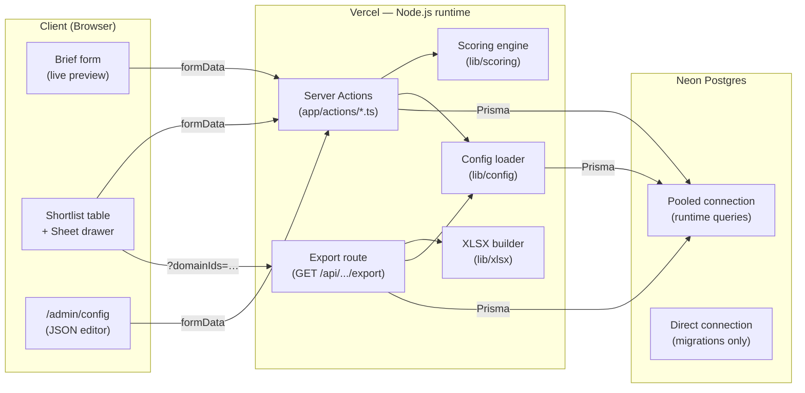
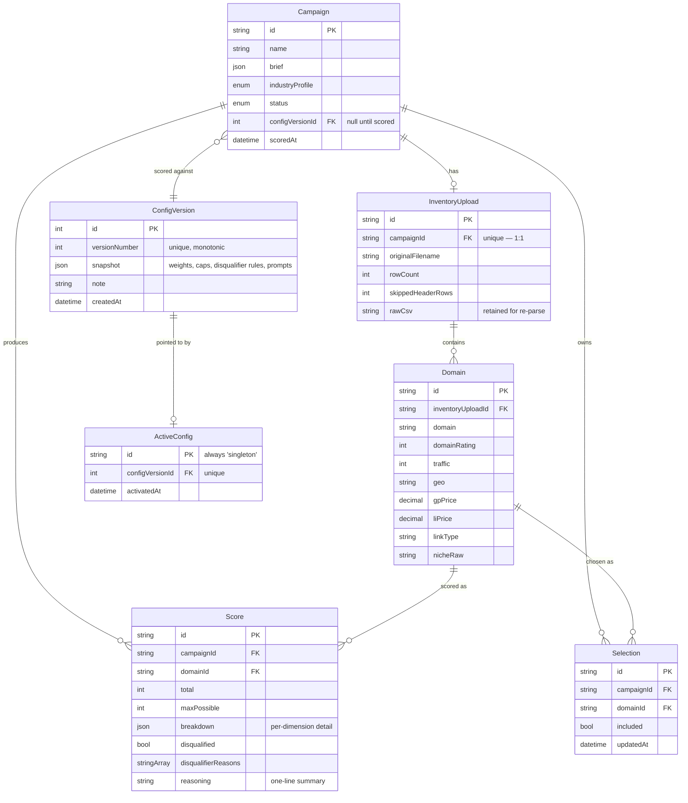
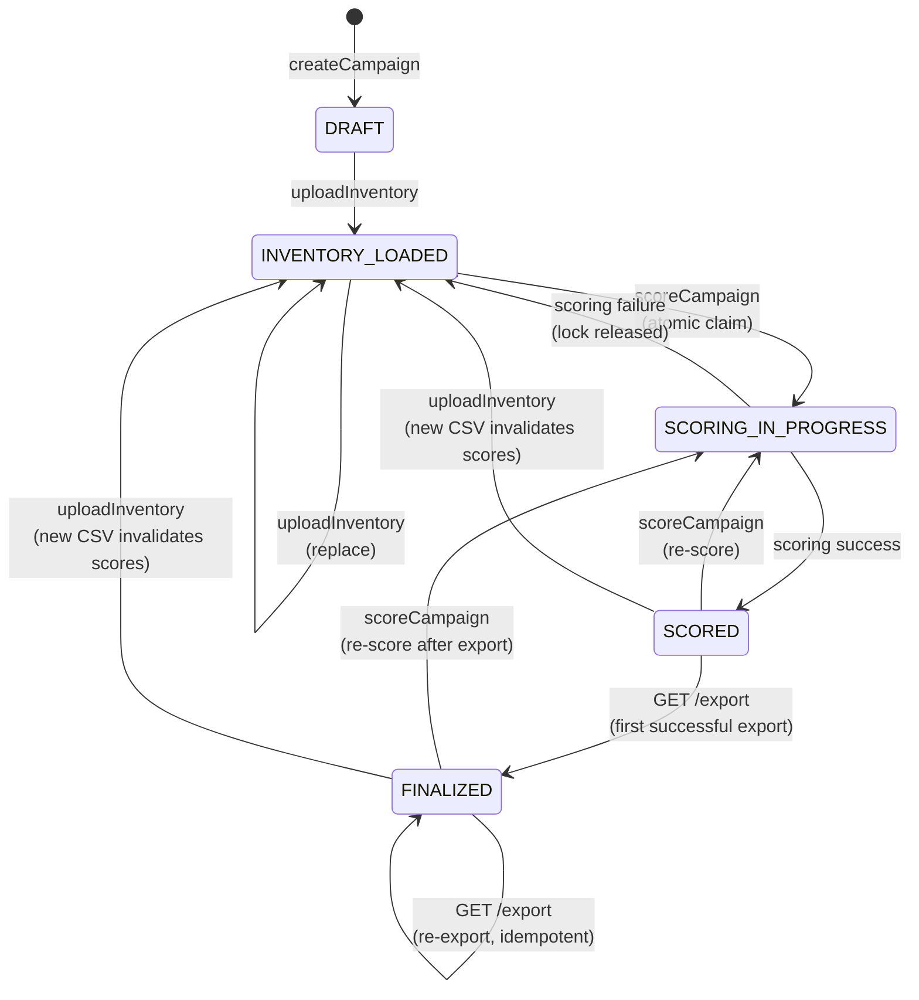
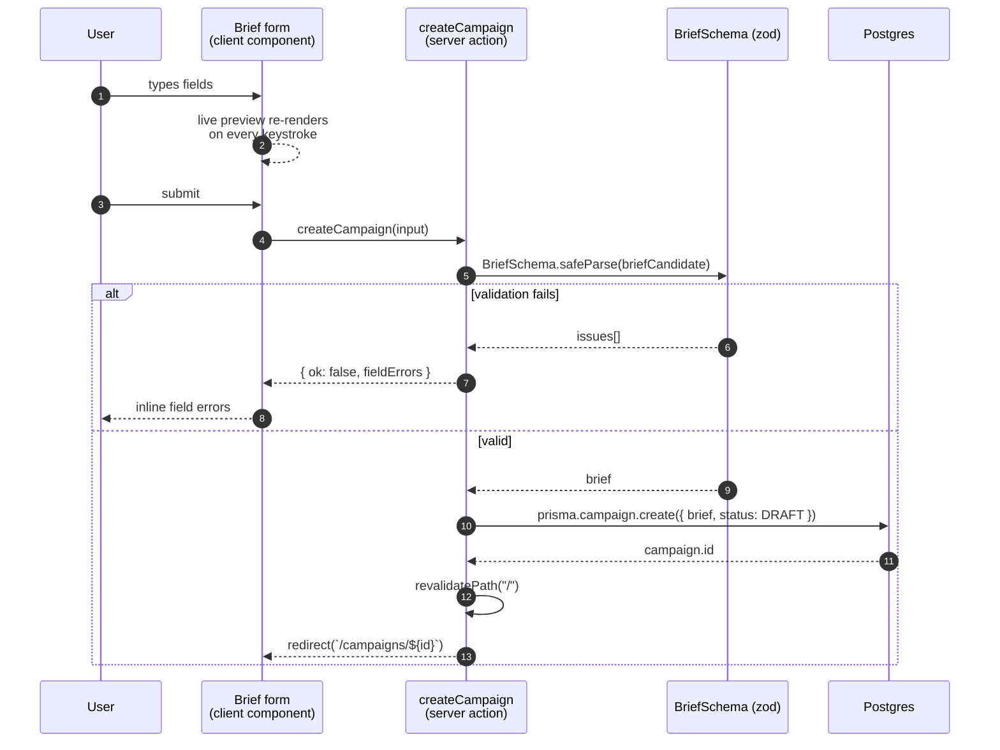
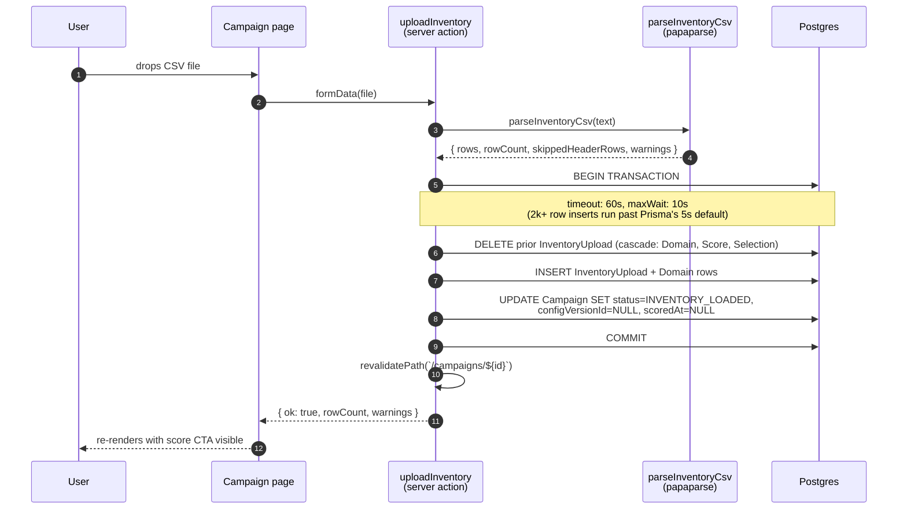
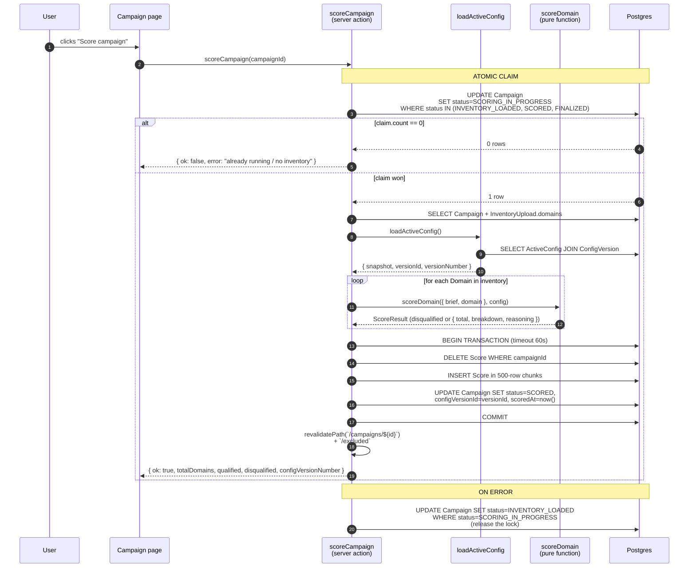
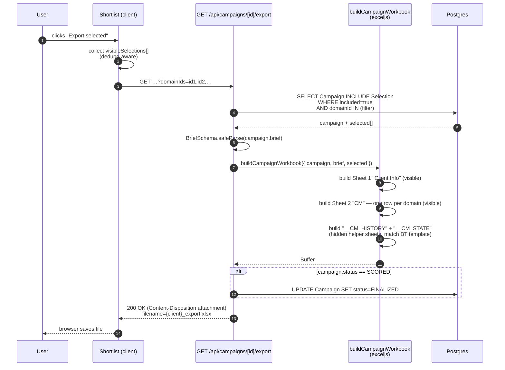
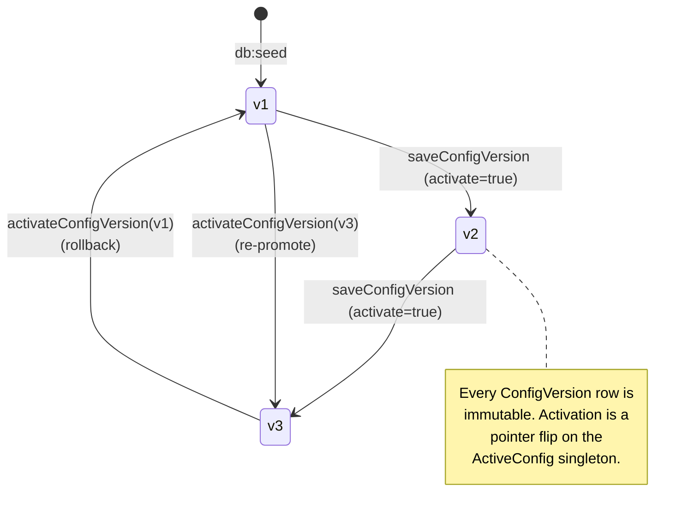
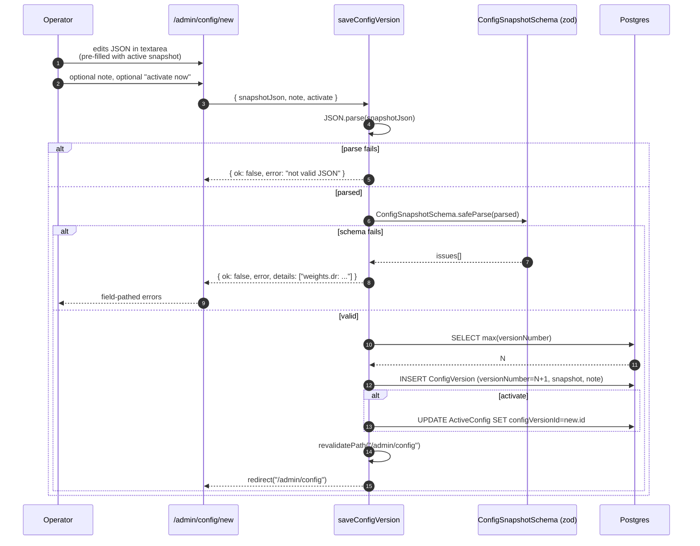

# Architecture

A reviewer's tour of the Domain Selector. Walks through the layers, the data model, the four core flows, the versioning lifecycle, and the invariants that keep scoring reproducible.

For the rationale behind the choices, see [`../DECISIONS.md`](../DECISIONS.md). This doc focuses on *how it works*, not *why*.

---

## 1. Overview

**What it is.** A single-tenant web app that takes a client brief and a vendor CSV inventory, scores every domain against a versioned 7-dimension framework, surfaces a shortlist with include/exclude controls, and exports a Campaign Management XLSX that drops straight into BlueTree's operations workflow.

**Stack at a glance.**

| Layer | Choice |
| --- | --- |
| Framework | Next.js 16 (App Router, Server Components, Server Actions) |
| Language | TypeScript (strict) |
| Styling | Tailwind v4 (`@theme` design tokens, dark by default) |
| ORM | Prisma 7 with `@prisma/adapter-pg` (driver-adapter model) |
| Database | Neon Postgres (pooled URL for runtime, direct URL for migrations) |
| Validation | Zod (one schema, used on both client preview and server action) |
| CSV / XLSX | `papaparse` (multi-line cell aware), `exceljs` |
| Hosting | Vercel |
| CI | GitHub Actions — `verify:scoring` + `verify:disqualifiers` on every push to `main` and every PR |

**No separate API surface.** Every mutation is a Server Action (`"use server"`). The only HTTP handler is `GET /api/campaigns/[id]/export` because XLSX download needs a streamable response with `Content-Disposition`.

---

## 2. System layers



**Pooled vs direct URL.** Neon's pooled hostname goes through pgBouncer in transaction mode, which doesn't hold the session state Prisma's migration runner needs for advisory locks. So runtime queries use `DATABASE_URL` (pooled), and `prisma migrate deploy` uses `DIRECT_URL` (non-pooled). Both env vars are required on Vercel; `prisma.config.ts` and `vercel-build` wire them up correctly.

---

## 3. Data model



### Invariants

- **`ActiveConfig` is a singleton.** Exactly one row, `id = "singleton"`. The whole app reads the active snapshot through `loadActiveConfig()`. Rollback = update one row.
- **`Campaign.configVersionId` is a hard pointer, not a soft reference.** Once scored, the campaign owns its config version. Activating a new `ConfigVersion` does *not* invalidate prior campaigns — they still resolve their original snapshot via `loadConfigVersion(id)`.
- **`ConfigVersion` rows are immutable.** Edits create new rows; nothing mutates `snapshot` in place. This is what makes the audit trail meaningful.
- **`Selection` rows survive re-scoring.** A user saying "I want this domain" outranks "we recomputed the math." The score-campaign action explicitly preserves `Selection` rows when replacing `Score` rows.

### Campaign lifecycle

`Campaign.status` is the source of truth for what a campaign can do next. The UI gates actions on it (upload only from `DRAFT`, score only from `INVENTORY_LOADED|SCORED|FINALIZED`, export only from `SCORED|FINALIZED`). The atomic-claim pattern in scoring relies on these transitions being conditional in SQL.



Uploading a new CSV resets the campaign back to `INVENTORY_LOADED` regardless of where it was — the cascade clears `Score` and `Selection` rows, and `configVersionId` / `scoredAt` are nulled so the UI knows any prior shortlist is stale.

---

## 4. Core flows

### 4.1 Campaign creation



`Campaign.brief` is stored as JSONB. The same `BriefSchema` validates on submit and again at scoring time — defensive re-parse, because the JSON column doesn't enforce structure.

### 4.2 Inventory upload



The transaction is wide on purpose: a partial upload would leave the campaign in an unrecoverable state where domains existed but no `InventoryUpload` parent did. All-or-nothing.

### 4.3 Scoring



**Why an `updateMany` for the claim, not a transaction or a row-level lock?** Postgres `UPDATE … WHERE status IN (…)` is atomic. The `WHERE` clause encodes the precondition ("a prior valid state") and the `SET` encodes the new state. If two scoring runs race, exactly one's update returns `count = 1`; the other returns `count = 0` and exits cleanly. No deadlocks, no advisory-lock fragility, no separate lock table.

**Selections survive.** The transaction deletes `Score` rows but never touches `Selection` rows. If a user already curated a shortlist and the operator re-scores after a config tweak, the curated picks persist.

### 4.4 Export



The `domainIds` query param is what enforces *what you see is what you export*. The Shortlist client knows which selected rows are visible after dedupe; it passes those exact IDs. Hidden dupes never reach the workbook.

XLSX headers are versioned in `lib/xlsx/headers.ts` and verified byte-for-byte against the real BlueTree template by `scripts/verify-export-fidelity.ts` (local-only — see CI section in the README).

---

## 5. Config versioning lifecycle





**Why JSON, not a form-by-field UI?** Editing a JSONB snapshot end-to-end with the full zod schema as a validator costs about half a day. A form-by-field UI to do the same job credibly (correct nesting, dynamic arrays, schema-aware error placement) is closer to a week. The textarea path gives technical operators *full* coverage of the schema today; a form layer can be added on top later without changing the storage shape. See `DECISIONS.md § What I'd change with more time` for that follow-up.

---

## 6. Determinism & reproducibility

The scoring engine is the single most important file in the repo to keep deterministic. `lib/scoring/engine.ts` is a pure function: `scoreDomain(input, config) → result`. No I/O, no `Date.now()`, no LLM, no randomness. Same `(brief, domain, config)` produces the same `(total, breakdown, reasoning)` every time.

This is enforced two ways:

1. **`scripts/verify-scoring.ts`** runs the framework's worked example through `scoreDomain` and asserts total = 82/100 across all 7 dimensions. Runs in CI on every push and PR.
2. **`scripts/verify-disqualifiers.ts`** covers all 7 disqualifier codes with a positive (triggers) and negative (doesn't trigger) case each. Runs in CI on every push and PR.

**What could become stochastic later but isn't today.** The config schema has `llm.prompts.*` fields wired through to `ConfigVersion.snapshot`, but no code path reads them. The framework explicitly leaves LLM enrichment of niche match as an "if you can swing it" item; we left the prompts in the schema so a future version can light it up without a migration, but the scoring path stays pure.

---

## 7. Concurrency model

Three places handle concurrent access:

| Concern | Mechanism | Where |
| --- | --- | --- |
| Double-score on refresh | Atomic conditional `updateMany` claim | `app/actions/score-campaign.ts` |
| Replace prior inventory | Transaction with `DELETE` cascade then re-insert | `app/actions/upload-inventory.ts` |
| Re-export during finalization | Idempotent — once `FINALIZED`, the export route just keeps returning the same workbook | `app/api/campaigns/[id]/export/route.ts` |

The scoring claim deserves a second look:

```ts
const claim = await prisma.campaign.updateMany({
  where: { id, status: { in: ["INVENTORY_LOADED", "SCORED", "FINALIZED"] } },
  data: { status: "SCORING_IN_PROGRESS" },
});
if (claim.count === 0) { /* another run is already in progress, exit */ }
```

This pattern works because Postgres `UPDATE … WHERE` is atomic. Two concurrent calls race for the same row; exactly one returns `count = 1`. The pattern is portable (no advisory locks, no `SELECT … FOR UPDATE`, no Redis), survives Vercel's stateless function model, and degrades gracefully — if the function crashes mid-scoring, the next user just sees the lock and gets a friendly error. On any error path, the catch block releases the lock back to `INVENTORY_LOADED` so the campaign isn't permanently stuck.

---

## 8. Failure modes & recovery

| Failure | What the user sees | What the system does |
| --- | --- | --- |
| Validation fails on brief submit | Field-pathed errors inline | No write; form re-renders with `fieldErrors` |
| CSV malformed (missing headers, etc.) | Error toast with header list + missing fields | No write; nothing changes |
| Scoring throws mid-run | Toast: "Scoring failed: {reason}" | Campaign status released to `INVENTORY_LOADED`; partial Score rows never committed (atomic transaction) |
| Concurrent scoring on refresh | "Scoring already in progress" | No-op; the running run completes normally |
| Config snapshot rejected by zod | Field-pathed errors above the textarea | No `ConfigVersion` row created; `ActiveConfig` untouched |
| Active config rollback to a removed version | (not possible — versions are immutable, never deleted) | n/a |
| Export with no selections | "No domains selected" guard rail before the route call | `selected.length == 0` → workbook not generated |
| Vercel function times out | 504 from the route, error logged | Campaign state unaffected (transactional) |

---

## 9. File map

Everything load-bearing, by concern:

```
app/
  actions/                         server actions (mutations)
    create-campaign.ts
    upload-inventory.ts
    score-campaign.ts              ← atomic claim + scoring loop
    toggle-selection.ts
    save-config-version.ts
    activate-config-version.ts
    delete-campaign.ts
  api/campaigns/[id]/export/
    route.ts                       ← only HTTP handler in the app
  campaigns/
    new/page.tsx                   brief form (live preview)
    [id]/page.tsx                  campaign workspace (upload → score → shortlist)
    [id]/excluded/page.tsx         disqualified rows view
  admin/config/
    page.tsx                       version list + activate buttons
    new/page.tsx                   JSON editor for new versions
  layout.tsx, page.tsx, error.tsx, loading.tsx, not-found.tsx

lib/
  brief/schema.ts                  Brief zod schema (canonical)
  config/
    types.ts                       ConfigSnapshot zod schema
    loader.ts                      loadActiveConfig, loadConfigVersion
    defaults.ts                    seed snapshot (db:seed entry)
  csv/
    parser.ts                      papaparse + header normalization
    types.ts                       CsvParseError class
  scoring/
    engine.ts                      scoreDomain (pure)
    dimensions.ts                  7 dimension scorers
    disqualifiers.ts               7 disqualifier checks
    reasoning.ts                   deterministic one-line summary
    types.ts                       ScoreInput / ScoreResult
  xlsx/
    export.ts                      buildCampaignWorkbook
    headers.ts                     CLIENT_INFO / CM / CM_HISTORY / CM_STATE headers
  db.ts                            Prisma client (driver-adapter)
  log.ts                           structured logger
  utils.ts                         cn(), small helpers

prisma/
  schema.prisma                    data model
  seed.ts                          inserts ConfigVersion v1 + singleton ActiveConfig

scripts/
  verify-scoring.ts                CI: worked example 82/100
  verify-disqualifiers.ts          CI: all 7 codes
  verify-export-fidelity.ts        local: header byte-match against template.xlsx
  smoke-imports.ts                 sanity check that nothing in lib/ throws on import

components/
  brief-form.tsx                   live-preview form (client)
  inventory-upload.tsx             CSV drop + uploadInventory caller
  score-button.tsx                 invokes scoreCampaign action
  scoring-in-progress.tsx          progress overlay
  shortlist.tsx                    high-density data grid + Sheet drawer
  export-button.tsx                visible-selections collector → /export
  config-editor.tsx                JSON textarea + schema validation
  activate-config-button.tsx       flips ActiveConfig pointer
  delete-campaign-button.tsx
  ui/                              primitives (button, input, field, sheet, pill, badge, card, back-link)

.github/workflows/
  verify.yml                       runs both verify scripts on push to main + PRs
```

Components carry no business logic — all the rules live in `lib/`. Components either render server-fetched data or invoke server actions; the scoring engine, config schema, CSV parser, and XLSX builder are all server-only modules.

---

## 10. What's intentionally not here

A short list of "is this missing?" questions a reviewer might have, with answers.

- **A background job queue.** Scoring runs synchronously inside the Server Action under Vercel's 60s function cap. Today's inventory sizes (~2k–10k rows) fit comfortably. A queue (Inngest / Upstash QStash) is the future-proofing call-out in `DECISIONS.md`, not a fix for a current problem.
- **Multi-tenant auth.** The spec is single-operator. Adding NextAuth + a `userId` foreign key on `Campaign` and `ConfigVersion` is one migration and one middleware away, but adding it now without a real user model would be guessing at requirements.
- **LLM enrichment of niche match.** Wired in the config schema (`llm.prompts.*`), inert in the scoring path. See § 6.
- **An OpenAPI spec.** There's one HTTP handler. The rest of the surface is Server Actions, which aren't an API.
- **`verify:export` in CI.** Deliberately local-only — the script's value is drift-detection against the actual BlueTree template (gitignored client data, ~565 KB). A CI fixture would either need the template hosted as a giant secret (over GitHub's 64 KB cap) or compared against a frozen copy of itself (which would just test that code matches code). See the README's CI section for the full rationale.
